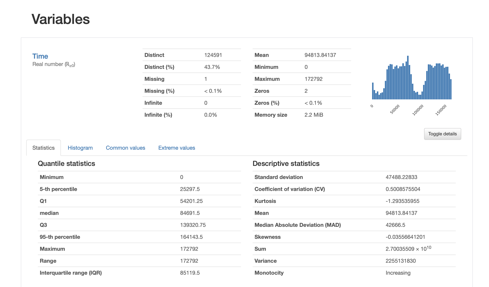

# Credit Card Fraud Prediction Model - using Azure ML
This project is my final capstone for Udacity's Nanodegree program: *Azure Machine Learning Engineer*. Credit card fraud is the most prevalent type of identity theft. According to the Federal Trade Commission, more than 270,000 Americans reported new or existing account fraud in 2019. Losses from fraud involving cards used for payment worldwide reached $27.85 billion in 2018. They are projected to rise to $35.67 billion in five years and $40.63 billion in 10 years. 

It is very important that credit card companies recognize fraudulent transactions so that customers are not charged for items that they did not purchase. Better yet, if companies can predict in real time when transaction happens to notify customers about possible fraud.

In this project, I am using credit card transactions data from Kaggle to train a machine learning model in Azure ML platform. I will be applying both hyperdrive and autoML methods to make the prediction.

## Project Set Up and Installation
1. Set up Azure ML workspace ([How to set up Azure ML workspace](https://docs.microsoft.com/en-us/azure/machine-learning/how-to-manage-workspace?tabs=azure-portal))
2. Set up Compute Instance ([How to set up Compute Instance](https://docs.microsoft.com/en-us/azure/machine-learning/how-to-create-manage-compute-instance?tabs=python))
3. Set up Compute Cluster ([How to set up Compute Cluster](https://docs.microsoft.com/en-us/azure/machine-learning/how-to-create-attach-compute-cluster?tabs=python))
4. If using Python SDK, [install the SDK](https://docs.microsoft.com/en-us/python/api/overview/azure/ml/install?preserve-view=true&view=azure-ml-py)

### Overview of Azure Machine Learning workflow:

<kbd> </kbd>   

## Dataset
This dataset contain transactions made by credit cards in September 2013 by european cardholders. It can be downloaded from [here](https://www.kaggle.com/mlg-ulb/creditcardfraud). It contains all numerical input variables which are the result of a PCA transformation. Due to confidentiality issues, details of data are not provided. Features V1 to V28 are the principal components obtained with PCA. Two other non-transformed features are 'Time' and 'Amount'. Feature 'Time' contains the seconds elapsed between each transaction and the first transaction in the dataset. The feature 'Amount' is the transaction Amount. Column 'Class' is the output variable (1 in case of fraud and 0 otherwise).

### Task
The task in this project is to predict if the credit card transaction is a fraud (1) or not (0). Since all input features are already the principal components of the actual variables, I am planning to use all the variables from v1 to v28, including time and amount. The output variable is called class.

### Access
The data is publicly available (link is added above in data section), so I am not uploading it in the project folder. I have uploaded the dataset to ML workspace. We can preview the data by clicking at 'Explore' tab. Both screenshots are attached.  

<kbd> </kbd>  

<kbd> </kbd>  

### Exploratory Data Analysis
Exploratory Data Analyis (EDA) is very important during ML project. Pandas profiling is a great python packaage that generates profile reports from a pandas DataFrame. The pandas df.describe() function is great but a little basic for serious exploratory data analysis. pandas_profiling extends the pandas DataFrame with df.profile_report() for quick data analysis.

| **Descriptive Stats**| **Corelation Heatmap** |
| ------- | ------ | 
| <kbd> </kbd>   |  <kbd> </kbd>  | 

Pandas profiling generates detailed html report, which is added in the project folder. Below is the snapshot:

<kbd> </kbd>   

## Automated ML
*TODO*: Give an overview of the `automl` settings and configuration you used for this experiment

### Results
*TODO*: What are the results you got with your automated ML model? What were the parameters of the model? How could you have improved it?

*TODO* Remeber to provide screenshots of the `RunDetails` widget as well as a screenshot of the best model trained with it's parameters.

## Hyperparameter Tuning
*TODO*: What kind of model did you choose for this experiment and why? Give an overview of the types of parameters and their ranges used for the hyperparameter search

### Results
*TODO*: What are the results you got with your model? What were the parameters of the model? How could you have improved it?

*TODO* Remeber to provide screenshots of the `RunDetails` widget as well as a screenshot of the best model trained with it's parameters.

## Model Deployment
*TODO*: Give an overview of the deployed model and instructions on how to query the endpoint with a sample input.

## Screen Recording
*TODO* Provide a link to a screen recording of the project in action. Remember that the screencast should demonstrate:
- A working model
- Demo of the deployed  model
- Demo of a sample request sent to the endpoint and its response

## Standout Suggestions
*TODO (Optional):* This is where you can provide information about any standout suggestions that you have attempted.
