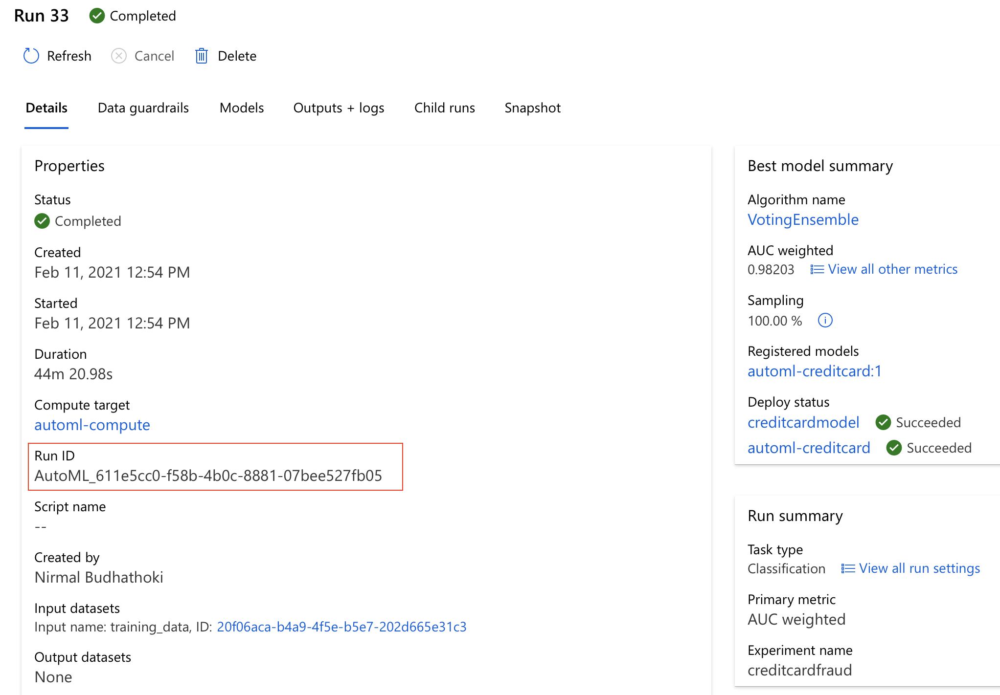
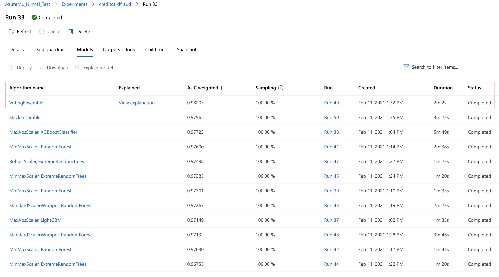
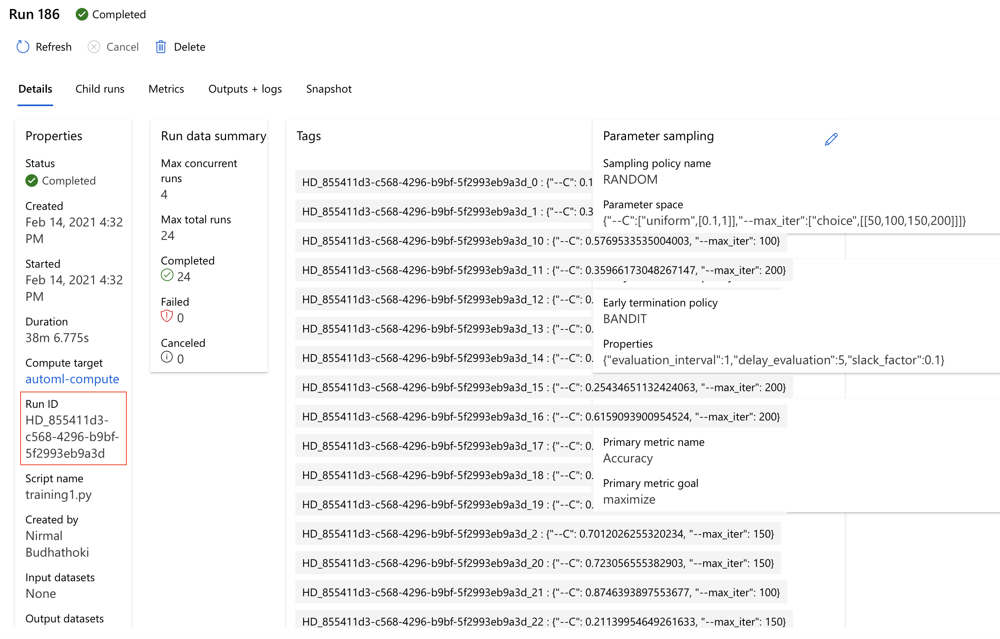
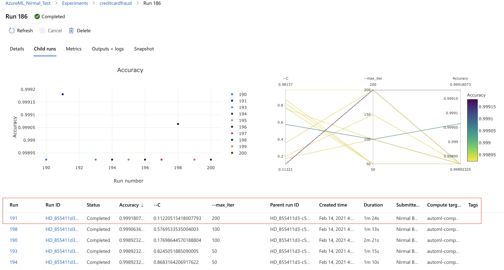
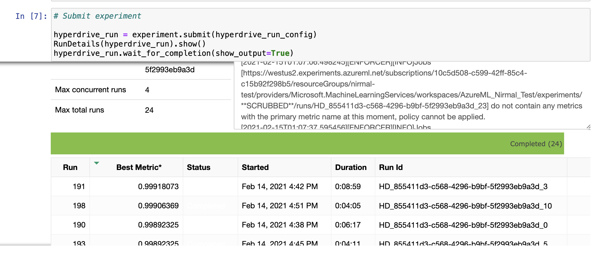
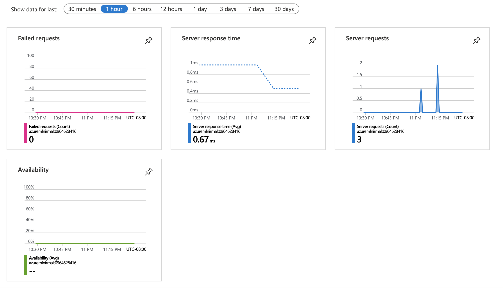

# Credit Card Fraud Prediction Model - using Azure ML
This project is my final capstone for Udacity's Nanodegree program: *Azure Machine Learning Engineer*. Credit card fraud is the most prevalent type of identity theft. According to the Federal Trade Commission, more than 270,000 Americans reported new or existing account fraud in 2019. Losses from fraud involving cards used for payment worldwide reached $27.85 billion in 2018. They are projected to rise to $35.67 billion in five years and $40.63 billion in 10 years. 

It is very important that credit card companies recognize fraudulent transactions so that customers are not charged for items that they did not purchase. Better yet, if companies can predict in real time when transaction happens to notify customers about possible fraud.

In this project, I am using credit card transactions data from Kaggle to train a machine learning model in Azure ML platform. I will be applying both hyperdrive and autoML methods to make the prediction.

## Project Set Up and Installation
1. Set up Azure ML workspace ([How to set up Azure ML workspace](https://docs.microsoft.com/en-us/azure/machine-learning/how-to-manage-workspace?tabs=azure-portal))
2. Set up Compute Instance ([How to set up Compute Instance](https://docs.microsoft.com/en-us/azure/machine-learning/how-to-create-manage-compute-instance?tabs=python))
3. Set up Compute Cluster ([How to set up Compute Cluster](https://docs.microsoft.com/en-us/azure/machine-learning/how-to-create-attach-compute-cluster?tabs=python))
4. If using Python SDK, [install the SDK](https://docs.microsoft.com/en-us/python/api/overview/azure/ml/install?preserve-view=true&view=azure-ml-py)

### Overview of Azure Machine Learning workflow:

<kbd> </kbd>   

## Dataset
This dataset contain transactions made by credit cards in September 2013 by european cardholders. It can be downloaded from [here](https://www.kaggle.com/mlg-ulb/creditcardfraud). It contains all numerical input variables which are the result of a PCA transformation. Due to confidentiality issues, details of data are not provided. Features V1 to V28 are the principal components obtained with PCA. Two other non-transformed features are 'Time' and 'Amount'. Feature 'Time' contains the seconds elapsed between each transaction and the first transaction in the dataset. The feature 'Amount' is the transaction Amount. Column 'Class' is the output variable (1 in case of fraud and 0 otherwise).

### Task
The task in this project is to predict if the credit card transaction is a fraud (1) or not (0). Since all input features are already the principal components of the actual variables, I am planning to use all the variables from v1 to v28, including time and amount. The output variable is called class.

### Access
The data is publicly available (link is added above in data section), so I am not uploading it in the project folder. I have uploaded the dataset to ML workspace. We can preview the data by clicking at 'Explore' tab. Both screenshots are attached.  

Screenshot showing data uploaded:
<kbd> </kbd>  

Screenshot showing Data Explore:
<kbd> </kbd>  

### Exploratory Data Analysis
Exploratory Data Analyis (EDA) is very important during ML project. Pandas profiling is a great python packaage that generates profile reports from a pandas DataFrame. The pandas df.describe() function is great but a little basic for serious exploratory data analysis. pandas_profiling extends the pandas DataFrame with df.profile_report() for quick data analysis.

| **Descriptive Stats**| **Corelation Heatmap** |
| ------- | ------ | 
| <kbd> </kbd>   |  <kbd> </kbd>  | 

Pandas profiling generates detailed html report, which is added in the project folder. Below is the snapshot:

<kbd> </kbd>   

## Automated ML

#### Auto ML architectural overview in Azure:

<kbd> </kbd>   

AutoMLConfig Class represents configuration for submitting an automated ML experiment in Azure Machine Learning. This configuration object contains and persists the parameters for configuring the experiment run, as well as the training data to be used at run time. Following are main parameters set for this experiment. The max run time is selected to be 30 minutes. This can be extended based on time and resources to commit. 

One important thing to mention is that I selected 'AUC weighted' method for primary metric instead of regular accuracy. This is because from EDA, I have learned that the classes are imbalanced. There are only 1% data for fraud vs non-fraud. AUC weighted metric performs better in this situation. When computing the weighted area under the ROC curve, weights vary with the values of the true positive rate (TPrate) among regions in a bid to focus on the accuracy of minority class that is more important in common.

#### AutoML Configuration:
| **AutoML Settings**| **Value Selected** |**Reason**|
| ------- | ------ | ------|
|experiment_timeout_minutes | 30 min| Time and resource constraint. This can be set to higher value if more resources can be allocated.|
|primary_metric| AUC weighted| To handle the Class Imbalance.|
|Task| Classification|Binary Classification problem.|
|n_cross_validations|k=5| Validation set to avoid overfitting. |

### Results

AutoML completed screenshot with RunId:
 <kbd> </kbd> 

AutoML best model ranked (Top one is selected):
<kbd> </kbd> 

The best model selected is Voting ensemble with accuracy of 0.98.

| **Confusion Matrix**| **ROC Curve** |
| ------- | ------ | 
| <kbd> </kbd>   |  <kbd> </kbd>  | 

#### Run Details

RunDetails showing AutoML experiment is running:
<kbd> </kbd>  

RunDetails showing AutoML experiment is complete:
<kbd> </kbd>  

#### Feature Importance 

Screenshot showing feature ranking for Voting Ensemble model:
<kbd> </kbd>  

## Hyperparameter Tuning

#### Hyper Drive workflow set up:

<kbd> </kbd>  

#### HyperDrive Config:

I am training Logistic regression model for hyperdrive method of modeling. Logistic regression is a classification algorithm, used to predict a binary outcome based on a set of independent variables. A binary outcome is one where there are only two possible scenarios— either the event happens (1) or it does not happen (0). In our case, fraud(1) vs. non fraud (0). Independent variables are those variables or factors which may influence the outcome (or dependent variable).

I have used random parameter sampling. In random sampling, hyperparameter values are randomly selected from the defined search space. It supports discrete and continuous hyperparameters. It also supports early termination of low-performance runs. Since random sampling selects random values from given range of values, the performance is fast.

#### HyperDrive Configuration:
| **Hyperparameters**| **Value Selected** |**Reason**|
| ------- | ------ | ------|
| C | uniform (0.1,1)| Returns a value uniformly distributed between 0.1 to 1. This controls the regularization over range of given values.|
|max_iters| choice(50,100,150,200)| Maximum iterations allowed to converge the algorithm. Randomly selects combination of C and max_iters to converge.|

I have selected bandit policy for early termination. It defines an early termination policy based on slack criteria, and a frequency and delay interval for evaluation. Again the main reason for this policy selection is performance and saving resources. Any run that doesn't fall within the slack factor or slack amount of the evaluation metric with respect to the best performing run will be terminated, thus saving the compute resource. Concretely, the configuration used in my hyperdrive config will evaluate jobs every 1 step and will terminate jobs that are not within 10 percent slack of the best performing job at that particular step. On larger models, this strategy typically saves significant compute time with no impact on the performance of the best model trained.

### Results

HyperDrive completed screenshot with RunId:
 <kbd> </kbd> 
 
HyperDrive best model from all the child runs (Top one is selected):
<kbd> </kbd> 

RunDetails showing HyperDrive experiment is running:
<kbd> </kbd>  

RunDetails showing HyperDrive experiment is complete:
<kbd> </kbd>  

## Model Deployment
Even though the accuracy is little bit higher in hyperdrive model, I have selected to deploy the AutoML model for two main reasons:
1. Logistic regression make strong assumption that all features are linearly independent (which is not always the case).
2. Comparatively ensemble models like Voting Ensemble (from AutoML) have lower bias because algorithm does not make simple assumptions like logistic regression, and lower variance because the algorithm combines many weak learners to make a strong predictor on unseen data.

#### Azure Container Instance

To deploy a model to Azure Container Instances, we need create a deployment configuration that describes the compute resources needed. For example, number of cores and memory. We also need an inference configuration, which describes the environment needed to host the model and web service.

Screenshot showing AutoML model deployed as Azure Container Instance:
<kbd> </kbd>  

Key is enabled for security, and application insights is enabled for tracking logs. 

Screenshot from ML studio showing RestUI, and app insights link: 
<kbd> </kbd>  

Clicking on app insights link can let us view the app insights (server availability, server requests and responses):

Screenshot showing appinsights logs:
<kbd> </kbd>  

Two data points from test set is passed via endpoint.py file for scoring. Result in json is shown below:

Screenshot showing result from endpoint.py :
<kbd> </kbd>  

## Screen Recording

[Link](https://www.youtube.com/watch?v=PCfMjb0ShBY) to the screen recording.

## Standout Suggestions
1. Explored Pandas Profiling package for indepth exploratory data analysis. It helps us generate html report with descriptive stats for all variables, including interactions among variables, corelation, missing values, and samples. [More info on pandas profiling](https://pandas-profiling.github.io/pandas-profiling/docs/master/rtd/). Screenshot can be found below:

<kbd> </kbd>  

2. Application insights is enabled, and log analytics is explored. There is a SQL like language KQL (Kusto Query Language), also called azure data explorer. The log analytics service connects with application insights telemetry data for performance and usage analysis. More information on log analytics can be found [here](https://docs.microsoft.com/en-us/azure/azure-monitor/log-query/log-analytics-tutorial). Snapshot is added below:

<kbd> </kbd>  

## Future Improvements
Time management was tough while working and parenting. I would like to explore more things in future:
1. ONNX model: I would like to explore ONNX model, to integrate the model into code, and use machine learning in Windows apps and devices.
2. Create an interactive web app in flask or streamlit to interact and use the model.

